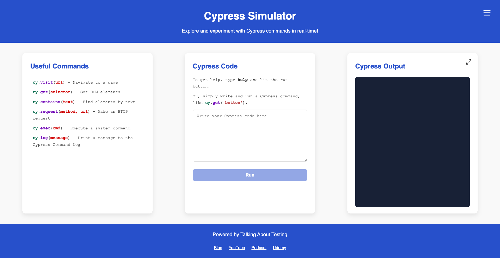

# Conhecendo a aplicação em teste 💻

Antes de começarmos a configurar o Cypress e escrever scripts de teste automatizados, deixe-me apresentar a aplicação que testaremos ao longo deste curso.

A aplicação se chama [_Cypress Simulator_](https://cypress-simulator.s3.eu-central-1.amazonaws.com/index.html) e foi desenvolvida utilizando HTML, CSS e JavaScript.

## O que é a aplicação _Cypress Simulator_?

A _Cypress Simulator_ é uma aplicação web interativa que permite experimentar e aprender comandos do Cypress em tempo real. Ela fornece um ambiente seguro para a prática de comandos do Cypress sem a necessidade de configurar e instalar o Cypress.

## Requisitos funcionais

### Autenticação

- O/a usuário/a deve efetuar _login_ para acessar o simulador
- A sessão de login persiste por 30 dias, a menos que o usuário efetue _logout_
- O/a usuário/a podem efetuar _logout_ pelo menu sanduíche no cabeçalho
- Nenhuma senha é necessária para esta aplicação de demonstração
- Verificação de CAPTCHA necessária durante o _login_ por questões de segurança
  - O/a usuário/a deve resolver um problema matemático simples
  - Várias tentativas são permitidas se a resposta for incorreta

### Consentimento de _cookies_ 🍪

- _Banner_ de consentimento de _cookies_ exibido para novos/as usuários/as
- O/a usuário/a deve aceitar ou recusar os _cookies_ explicitamente
- O _banner_ inclui:
  - Uma explicação clara do uso de _cookies_
  - Botões de Aceitar e Recusar
- A preferência do usuário é lembrada para futuras visitas

### Interface gráfica do usuário (_GUI_)

- Cabeçalho
  - Exibe o título da aplicação: "_Cypress Simulator_"
  - Exibe um parágrafo com o texto: "_Explore and experiment with Cypress commands in real-time!_"
  - Inclui um menu sanduíche para navegação
  - Mostra a opção de logout ao abrir o menu sanduíche
- Conteúdo principal
  - Exibe comandos úteis do Cypress com suas devidas descrições
  - Fornece uma área de entrada de código para escrever comandos do Cypress
  - Mostra a saída da execução dos comandos em uma seção dedicada
  - Permite que a seção de saída seja maximizada e minimizada
- Entrada e saída
  - Suporte a comandos comuns do Cypress, tais como: `cy.visit`, `cy.get`, `cy.contains`, `cy.request`, `cy.exec`, `cy.log`, etc.
  - Fornece feedback imediato sobre a execução dos comandos
  - Mostra mensagens de sucesso, erro e _warning_ com base na validade do comando
  - Inclui um comando de ajuda para exibir exemplos de uso
- Rodapé
  - Exibe o crédito "_Powered by Talking About Testing_"
  - Fornece os seguintes links da Talking About Testing:
    - Blog
    - YouTube
    - Podcast
    - Udemy
  - Todos os links abrem em uma nova aba do navegador

### Imagem da _GUI_

Abaixo está um exemplo de como a aplicação se parece em um _viewport desktop_.

## Resumo

A aplicação _Cypress Simulator_ é uma ferramenta de aprendizado que ajuda a praticar os comandos de teste do Cypress sem nenhuma configuração. Pense nela como uma aplicação onde você pode:

- Experimentar os comandos do Cypress com segurança
- Obter feedback imediato sobre o que funciona e o que não funciona
- Aprender com exemplos e documentação de ajuda
- Praticar sem medo de quebrar nada

A ferramenta foi projetada para ser:

- Fácil de usar (basta fazer login e começar a digitar os comandos)
- Educacional (inclui exemplos e ajuda)
- Acessível (funciona em qualquer navegador moderno)
- Conveniente (lembra que você está conectado por 30 dias)
- Segura (inclui verificação de CAPTCHA)
- Focada na privacidade (é necessário consentimento explícito de _cookies_)

Nenhum conhecimento técnico é necessário para começar a usar o simulador, tornando-o perfeito para iniciantes que estão aprendendo testes com Cypress.

## Teu desafio 🎯

Durante o curso, te desafio a testar **TODAS** as funcionalidades da aplicação _Cypress Simulator_.

Espero que você esteja tão ansioso/a para começar, quanto estou para guiá-lo/a ao longo do caminho! 🧑‍🏫

Vá para a [lição 0](./0.md) para configurar o projeto de testes.
